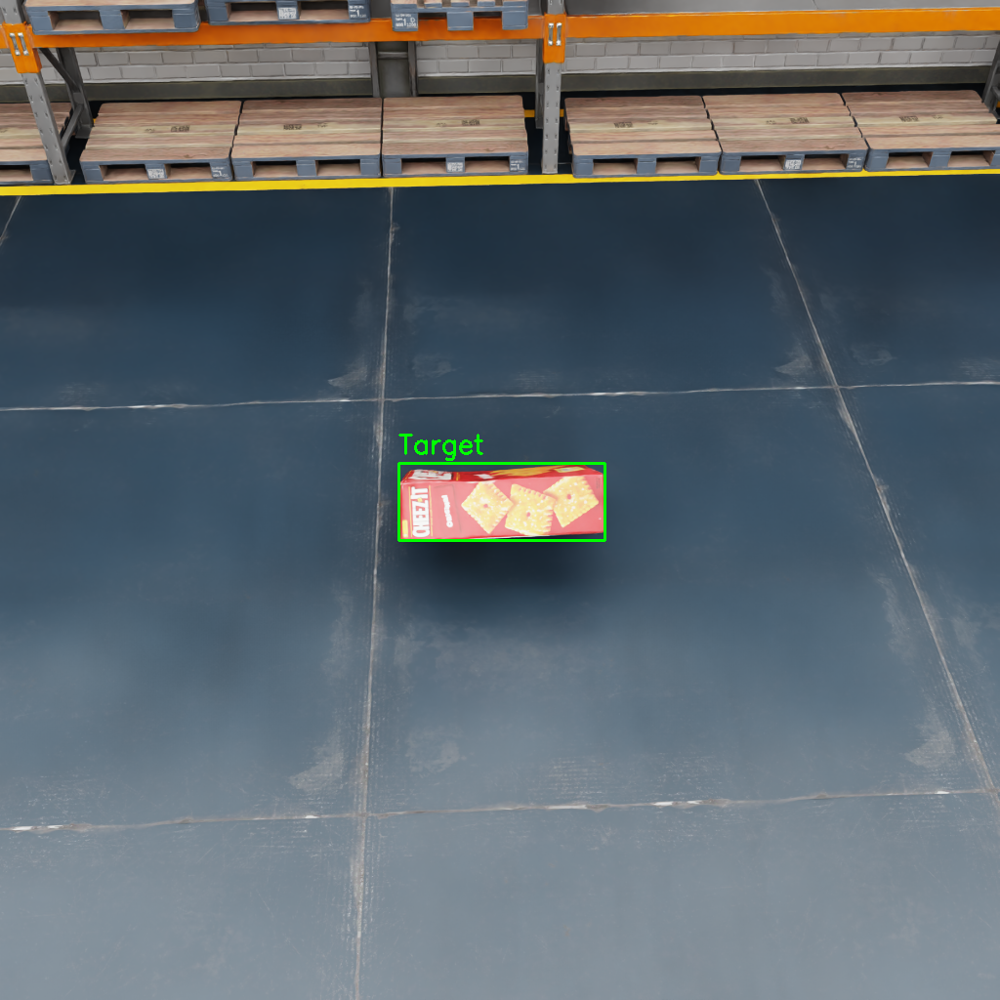
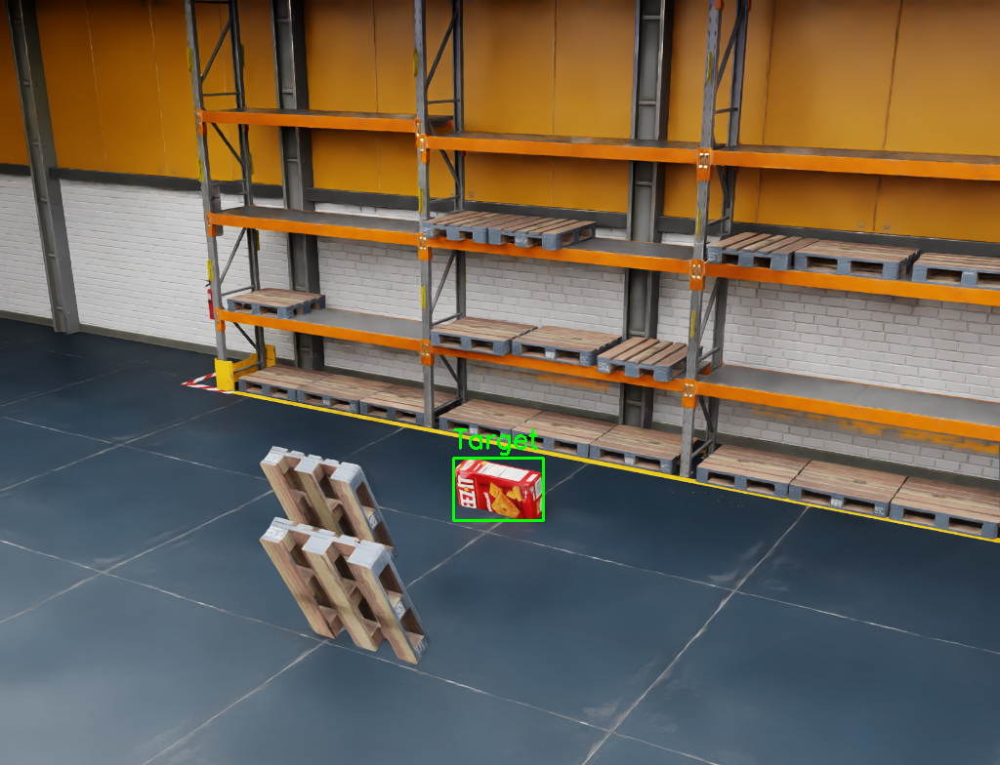
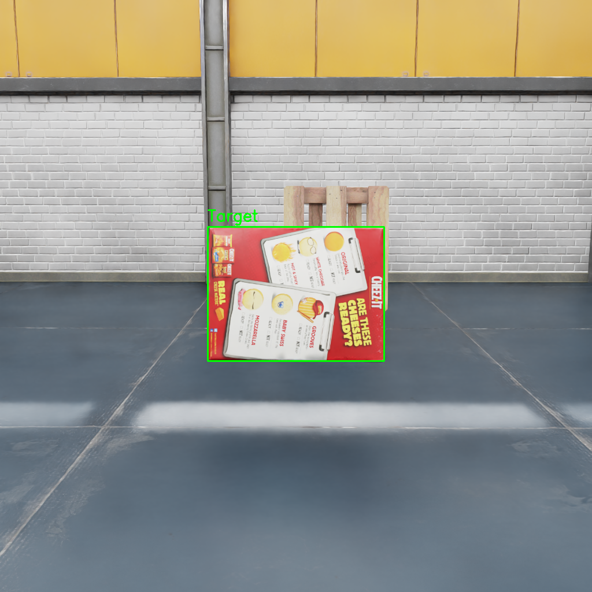
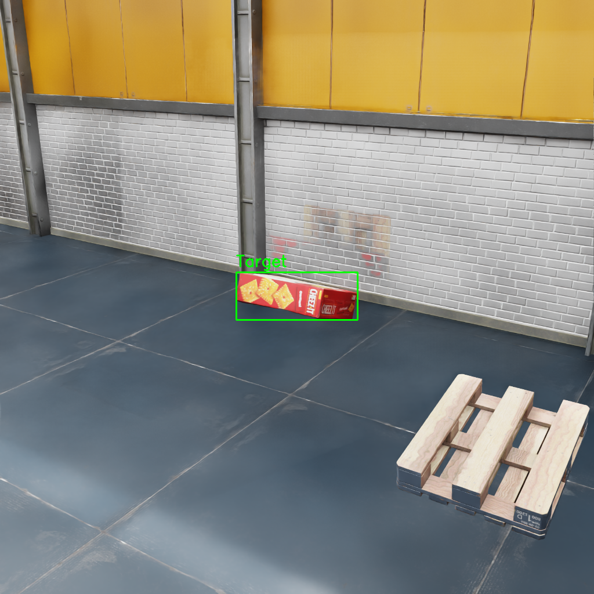

# Issac Data Synth

[](https://developer.nvidia.com/isaac-sim)
[](https://www.python.org/)
[](https://docs.ultralytics.com/)
[](./LICENSE)

A synthetic data generation pipeline for robotic perception. It builds a digital-twin
warehouse scene in NVIDIA Isaac Sim, renders randomized frames with automatic labels,
and converts them into a clean YOLOv8-ready training dataset.


*The generator randomizing pose, lighting, and camera angle across frames.*

## Why this exists

Collecting and hand-labeling real images of industrial environments is slow and
expensive. This project generates effectively unlimited labeled training data in
simulation instead, and closes the sim-to-real gap with three techniques:

1. **Photorealistic assets** - a USD warehouse environment with textured target objects.
2. **Domain randomization** - lighting, object pose, and camera angle vary every frame
   so the model learns the object instead of the background.
3. **Negative mining** - unlabeled distractor objects (pallets) appear in frame so the
   model also learns what *not* to detect.

## How it works

The pipeline has three stages, each handled by one script in `src/`:

| Stage | Script | What it does |
|---|---|---|
| Direct | `src/scene_generator.py` | Builds the warehouse scene and renders randomized frames with Isaac Sim Replicator |
| Translate | `src/smart_converter.py` | Converts raw Replicator output (`.npy` boxes + semantic JSON) into normalized YOLOv8 `.txt` labels, keeping only the target class |
| Verify | `src/visualize.py` | Draws predicted boxes back onto sample images so label quality can be inspected visually |

Two helpers support training: `fix_folder.py` reorganizes rendered frames into the
`images/` layout YOLO expects, and `train_model.py` launches YOLOv8 training from
`data.yaml`.

## Sample output

These frames were rendered by the generator and labeled by the converter.
Bounding boxes were drawn by the visualizer:

| Sample 1 | Sample 2 |
|---|---|
|  |  |

| Sample 3 | Sample 4 |
|---|---|
|  |  |

A fifth sample is available at `src/debug_vis_rgb_0004.png`.

## Repository structure

```text
issac-data-synth/
├── src/
│   ├── scene_generator.py      # Simulation script: builds and randomizes the scene
│   ├── smart_converter.py      # Converts Replicator output to YOLOv8 labels
│   ├── visualize.py            # Draws labels on images for quality checks
│   └── debug_vis_rgb_*.png    # Sample labeled frames
├── ezgif.com-optimize.gif      # Screen recording of the generator in action
├── train_model.py              # Trains YOLOv8n on the generated dataset
├── fix_folder.py               # Reorganizes rendered frames into images/ layout
├── data.yaml                   # Dataset config (paths, split, class names)
├── requirements.txt            # Python dependencies for conversion and training
├── .gitignore                  # Excludes generated datasets and model weights
├── LICENSE                    # MIT License
└── README.md
```

## Prerequisites

- NVIDIA Isaac Sim (2023.1.1 or newer) with the Replicator API, for `scene_generator.py`
- Python 3.10
- A YOLOv8-capable environment for training (`ultralytics`, see `requirements.txt`)

Install the Python dependencies:

```bash
pip install -r requirements.txt
```

## Quickstart

### 1. Generate the simulation

Open `src/scene_generator.py` in the Isaac Sim Script Editor and run it.
Before running, set `OUTPUT_DIR` at the top of the file to the folder where frames
should be written.

- Input assets: `003_cracker_box.usd` (target), `warehouse.usd` (environment),
  pallet USD (distractors). Local Nucleus assets are used when available, with
  S3-hosted fallbacks otherwise.
- Output: a run folder (default `output/fancy_run/`) containing RGB frames plus
  raw `.npy` bounding-box files and a semantic-mapping JSON.

The script renders `NUM_FRAMES` frames (default 100) at 1024x1024.

### 2. Organize the frames

```bash
python fix_folder.py
```

This moves rendered `rgb_*.png` files into `output/fancy_run/images/`. If your run
folder differs, update `BASE_DIR` at the top of `fix_folder.py` first.

### 3. Convert labels to YOLOv8 format

```bash
python src/smart_converter.py
```

Set `DATA_DIR` at the top of the file to your run folder. The converter finds the
semantic ID of `industrial_box` in the mapping JSON, keeps only matching boxes,
normalizes coordinates to YOLO format, and writes one `.txt` file per frame into
`labels/`. Frames showing only distractors still get an (empty) label file, which
is what YOLO expects for background samples.

### 4. Verify label quality

```bash
python src/visualize.py
```

This draws the YOLO boxes for the first five frames and saves them as
`debug_vis_*.png` in the current directory. Open them and confirm the boxes sit
tightly on the target object before training.

### 5. Train

```bash
python train_model.py
```

This trains YOLOv8n for 20 epochs at 640px resolution, reading its dataset paths
from `data.yaml` and writing checkpoints under `runs/`. Point `data.yaml` at your
run folder first (see Configuration).

## Configuration

| Setting | File | Default | Notes |
|---|---|---|---|
| `OUTPUT_DIR` | `src/scene_generator.py` | `/path_to/issac-data-synth/output` | Root folder for all generated runs |
| `NUM_FRAMES` | `src/scene_generator.py` | `100` | Frames rendered per run |
| `DATA_DIR` | `src/smart_converter.py`, `src/visualize.py` | `/path_to/issac-data-synth/output/fancy_run` | Must match the run folder from step 1 |
| `BASE_DIR` | `fix_folder.py` | `output/fancy_run` | Relative to the repo root |
| `path` / `train` / `val` | `data.yaml` | `output/fancy_run` | Dataset root and splits |
| `names` | `data.yaml` | `0: industrial_box` | Single target class |
| `epochs` / `imgsz` | `train_model.py` | `20` / `640` | Training length and image size |

To detect a different object, change the `semantics` class in `scene_generator.py`
and update `TARGET_LABEL` in `smart_converter.py` plus `names` in `data.yaml`
to match.

## Notes and limitations

- The generator must run inside Isaac Sim; the remaining scripts run in any Python
  environment with the listed dependencies.
- The bundled samples and demo GIF illustrate a single warehouse setup. New
  environments or assets will need their USD paths updated in `scene_generator.py`.
- Domain randomization narrows the sim-to-real gap but does not eliminate it;
  validate on real images before deploying a trained model.

## License

MIT License - see [LICENSE](./LICENSE). Copyright (c) 2026 Rithwik Reddy Eedula.
